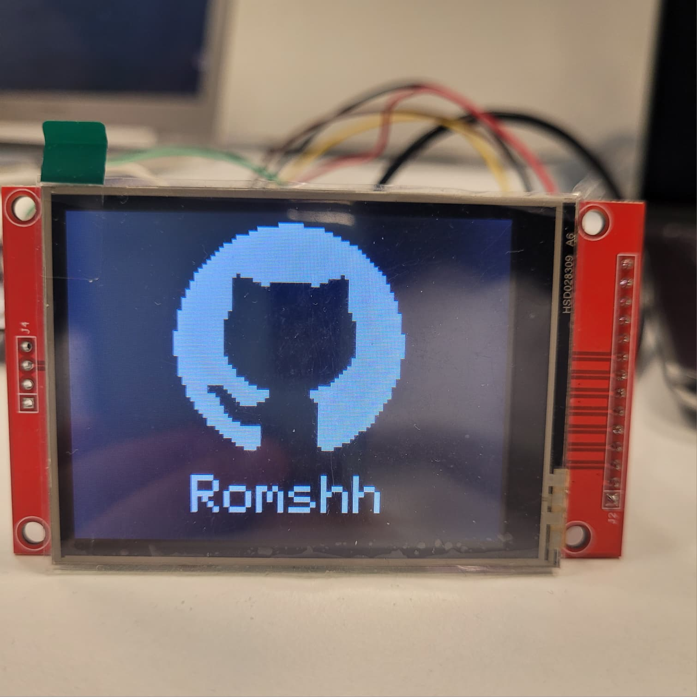

# stm32-ili9341-spi

A small ILI9341 display driver for STM32, written with the HAL. Four files,
no dependencies, no malloc.

I wrote this while learning SPI on an STM32F7. It does drawing, images and
scalable text, and nothing else. If you need touch or SD, this is not it.

The repo is a complete STM32CubeIDE project, so you can just import it and
run it to see if your wiring works. The demo draws the GitHub logo and my
username under it.


This picture is not a photo. I generated it from the same logo array and the
same font table the firmware uses, so it matches the panel pixel for pixel.

## What I tested it on

- NUCLEO-F767ZI (STM32F767ZIT6U)
- 2.8" ILI9341 module, 240x320, the cheap red one with the SD slot
- 3.3V, SPI1 at 3 MBit/s by default, tested up to 48 MBit/s
- STM32CubeIDE 2.2.0, CubeMX 6.18.1, arm-none-eabi-gcc 14.3

Other STM32 families should be fine too. The driver only calls HAL_Delay,
HAL_GPIO_WritePin and HAL_SPI_Transmit, and those are the same everywhere,
so you only need to change the pins and the SPI handle in lcd_conf.h. I have
not tried it on anything other than the F767 though.

## Wiring

| Display | Nucleo |
| --- | --- |
| SCK | PA5 |
| MOSI | PB5 |
| CS | PA4 |
| DC | PA6 |
| RESET | PB6 |
| VCC | +3V3 |
| LED | VDD |
| GND | GND |

Three things that cost me time here:

- The module has no regulator. 3.3V only, do not put 5V on VCC.
- Do not tie RESET to the supply. lcd_init() pulses it, and the display will
  not wake up without that pulse.
- If you forget the LED pin the backlight stays off and you see nothing, even
  though the code is running fine.

MOSI is on PB5 and not PA7 because PA7 is used by the Ethernet PHY on this
board. If you use a different board, check that first.

## CubeMX settings

SPI1 as Transmit Only Master, hardware NSS disabled.

| Setting | Value |
| --- | --- |
| Data Size | 8 Bits |
| CPOL | Low |
| CPHA | 1 Edge |
| First Bit | MSB |
| CRC | Disabled |
| Prescaler | start around 3 MBit/s |

CS, DC and RESET are plain GPIO outputs. Set CS and RESET to High as their
initial state.

Watch out for Data Size. If you never click that field CubeMX can leave it at
4 bits, and then only the low half of every byte goes out. The display never
wakes up and you get no error anywhere. I lost a good while on this, so check
it first if you see a blank screen.

## Using it in your own project

Copy lcd.c into Core/Src, and lcd.h, lcd_conf.h and font5x7.h into Core/Inc.
Then edit lcd_conf.h. That is the only file you should need to touch: SPI
handle, the three pins, screen orientation and size, and the maximum text
scale.

```c
#include "lcd.h"

lcd_init();
lcd_clear(BLACK);
lcd_text(10, 10, "hello", WHITE, BLACK, 2);
```

Call lcd_init() after MX_SPI1_Init(), not before.

## Functions

```c
void lcd_init(void);
void lcd_clear(uint16_t color);
void lcd_pixel(uint16_t x, uint16_t y, uint16_t color);
void lcd_rect_fill(uint16_t x, uint16_t y, uint16_t w, uint16_t h, uint16_t color);
void lcd_rect(uint16_t x, uint16_t y, uint16_t w, uint16_t h, uint16_t color);
void lcd_image(uint16_t x, uint16_t y, uint16_t w, uint16_t h, const uint16_t *data);
void lcd_char(uint16_t x, uint16_t y, char c, uint16_t fg, uint16_t bg, uint8_t scale);
void lcd_text(uint16_t x, uint16_t y, const char *s, uint16_t fg, uint16_t bg, uint8_t scale);
```

Colors are RGB565. RED, GREEN, BLUE, BLACK and WHITE are in lcd.h, add your
own if you need more.

lcd_image() takes a flat array in row order, w*h entries, one uint16_t per
pixel.

The font is 5x7 in a 6x8 box, ASCII 32 to 126, so lowercase works. scale
draws every font dot as a scale x scale square, so scale 3 gives you 18x24
characters. Anything outside the table is drawn as a space.

## Speed

Blocking transfers, SPI at 3 MBit/s, HCLK 96 MHz:

| What | Pixels | Time |
| --- | --- | --- |
| Full screen | 76800 | 516 ms |
| Rectangle outline | 160 | 3 ms |

Same code with the prescaler at 2, so 48 MBit/s:

| What | Pixels | Time |
| --- | --- | --- |
| Full screen | 76800 | 94 ms |

16 times the clock bought 5.5 times the speed. Shifting 153600 bytes at that
rate takes about 26 ms, so most of what is left is not the wire. It is
HAL_SPI_Transmit polling the TXE flag one byte at a time. Past this point the
wire is faster than the loop feeding it and the clock stops being the thing
that matters.

## Limitations

- Blocking only. No DMA version in here, so a full screen bottoms out around
  94 ms no matter how high you push the clock.
- One font, one size family.
- No reading back from the display, the SPI is transmit only.
- No touch, no SD card.
- Nothing is checked against the screen bounds. If you draw outside, the
  window command goes out of range and the drawing quietly disappears.

## On the actual board



Same demo on my desk. The background looks dark gray instead of black
because I use a TFT panel that is not capable of showing true black unlike OLED panels, the code really does
send 0x0000.

## License

MIT. See LICENSE.

The GitHub logo in the demo belongs to GitHub, I only used it as an example
picture.
